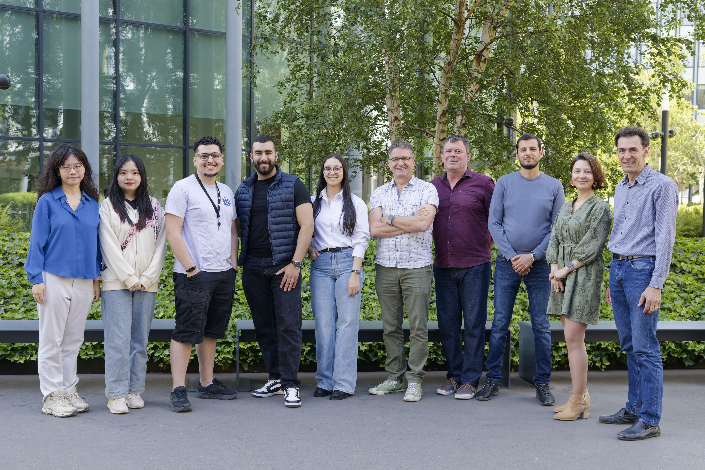

## About Me

I'm an AI researcher and a PhD candidate at Sorbonne University's LIP6 lab in Paris. My work lives at the crossroads of Machine Learning, Natural Language Processing, and Data Management. I'm driven by a central philosophy: In an age of information overload, how can we build intelligent systems that not only find data but maximize *exploiting* it?

My research focuses on developing novel methods for **table representation learning**. In simple terms, I teach computers how to make sense of the vast, complex, and often chaotic tables of data that form the backbone of modern data lakes. The goal is to create AI that can automate the difficult tasks of data discovery and integration (like table union & join search, as well as table reclamation), ultimately helping us uncover deeper insights and maximize the value of the information we collect.

#### Affiliation and Supervision

* **Laboratory:** I am a member of the [LIP6 Database Research Team](https://bd.team.lip6.fr/en/site/start).
* **Supervisors:** My PhD is supervised by Professors Bernd Amann and Hubert Naacke, and Assistant Professor Rafael Angarita.

## Experience and Contributions

Before diving deep into my PhD, I gained valuable experience applying these concepts in the real world. As a co-founder and AI Engineer at **Sujet AI**, I led the development of open-source foundational models (LLMs, VLMs) and specialized datasets to democratize financial analysis. At **RTE**, France's national electricity operator, I designed and deployed a system called BERTrend to detect emerging trends and weak signals from social media, helping to anticipate real-world events. My research journey began at **LIP6**, where I investigated how advanced topic models could be used to automatically identify major paradigm shifts in scientific literature.

Through these roles, I've had the opportunity to build and contribute to tools that make data more accessible and interpretable, a theme that continues to drive my current research.

## Hobbies and Interests

When I'm not training models or wrangling data, I'm usually immersed in a different kind of world. I'm an avid gamer with a deep appreciation for rich, story-driven single-player experiences. There's nothing quite like getting lost in a masterfully crafted narrative. I'm also a huge film buff, with a particular soft spot for thrillers that make you think long after the credits roll.

Fluent in English 🇺🇸, French 🇫🇷, and Arabic 🇩🇿, I love exploring the world with my wife. And when we're home, our time is happily managed by our cats 😸

Here are a few of my all-time favorites:

* **Games:** *Red Dead Redemption 2, Silent Hill 2, The Last of Us, Cyberpunk 2077*
* **Movies:** *12 Angry Men, Prisoners, There Will Be Blood, Manchester by the Sea, The Lighthouse*
* **Music:** My playlists are an eclectic mix of Heavy Metal, Hip Hop, and Drum & Bass.

If you happen to share any of these interests, we'll have plenty to talk about (aside from work related stuff) while cracking open a cold one!