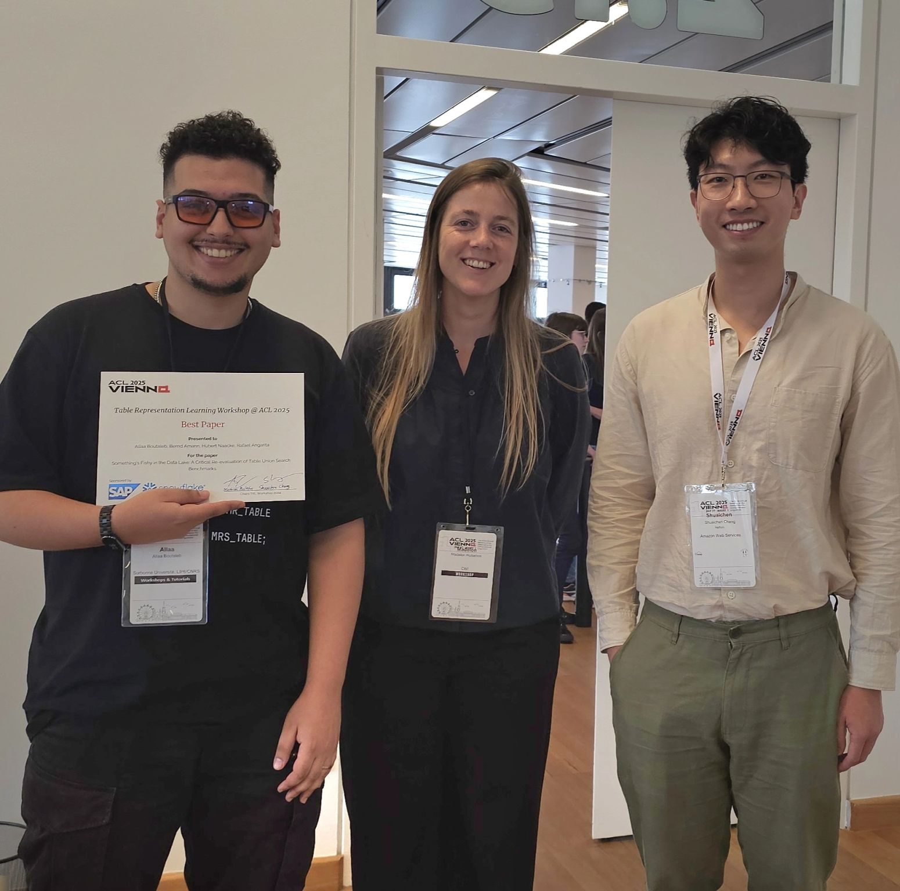
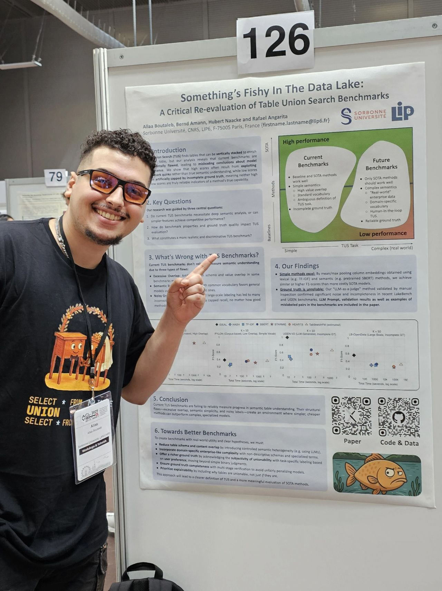
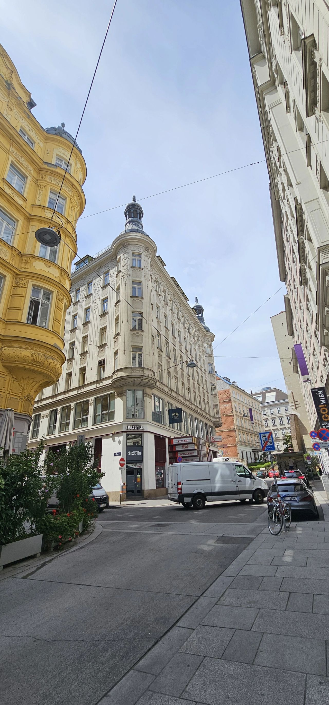

I'm thrilled to share that our paper received the **Best Paper Award** at the **ACL 2025 Workshop on Table Representation Learning** in Vienna, Austria 🇦🇹.

It was an absolute honor to present our work at such a vibrant and insightful event.  
Huge thanks to the workshop chairs — Madelon Hulsebos, Shuaichen Chang, Qian Liu, Wenhu Chen, and Huan Sun — for creating a space that sparked so many rich discussions in the tabular data research community.

This achievement would not have been possible without the support and guidance of my supervisors **Bernd Amann**, **Hubert Naacke**, and **Rafael Angarita**, and the incredible **Database team at LIP6 - Laboratoire d'informatique**.

---

## Links
- 📄 **Paper**: [aclanthology.org/2025.trl-1.7.pdf](https://aclanthology.org/2025.trl-1.7.pdf)  
- 💻 **Code & Data**: [github.com/Allaa-boutaleb/fishy-tus](https://github.com/Allaa-boutaleb/fishy-tus)  

---

*Feeling grateful, motivated, and inspired to keep pushing the boundaries of research in data discovery and table representation learning.*  

Here are some photos to remember the day — and yes, peep the t-shirt 😉

